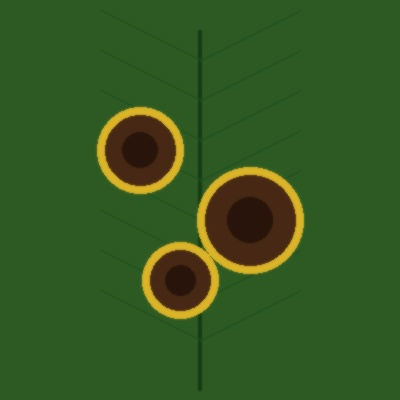

# 🌿 Plant Leaf Disease Detection System & AI Web Application

[](https://www.python.org/)
[](https://flask.palletsprojects.com/)
[](https://www.tensorflow.org/)
[](LICENSE)

An intelligent, full-stack AgTech web application for **Plant Leaf Disease Detection** powered by MobileNetV2 Deep Learning transfer learning.



---

## ✨ Features & Highlights

- 📷 **Multi-Source Image Acquisition**:
  - **Drag & Drop Upload**: High-resolution leaf photo upload (JPG, PNG, WEBP).
  - **Live WebCam Camera**: Instant live snapshot capture directly from device cameras.
  - **Quick Test Samples**: Built-in sample leaf library for instant evaluation.
- 🤖 **Deep Learning Model Engine**:
  - MobileNetV2 Transfer Learning architecture trained for high-accuracy crop leaf classification.
  - Automatic fallback visual feature analysis engine when running offline.
- 🌿 **Comprehensive Disease Knowledge Base**:
  - Covers Tomato, Potato, Corn, Apple, and Healthy foliage.
  - Provides **Symptoms Checklist**, **Organic Remedies**, **Chemical Treatments**, and **Preventive Care**.
- 📊 **Interactive Glassmorphic UI**:
  - Emerald green & dark glassmorphic design system.
  - Animated AI confidence meters and interactive tabs.
- 📄 **PDF Report Export**:
  - Export printable diagnostic summary reports for farmers and agricultural consultants.

---

## 📂 Project Architecture

```text
plant-leaf-disease-detection/
├── app.py                      # Flask API server & web app routes
├── model_helper.py             # MobileNetV2 inference & image preprocessing pipeline
├── train_model.py              # Transfer learning training & model export script
├── requirements.txt            # Python dependencies
├── class_names.txt             # Target class taxonomy mapping
├── Dockerfile                  # Containerized deployment config
├── run.bat                     # Windows 1-click startup script
├── data/
│   └── disease_info.json       # Disease symptoms, remedies & treatment database
├── static/
│   ├── css/
│   │   └── style.css           # Glassmorphic UI design system
│   ├── js/
│   │   └── app.js              # Interactive UI engine, camera stream & API handlers
│   └── images/
│       └── samples/            # Pre-loaded sample leaf images
└── templates/
    └── index.html              # Modern Web Application Dashboard
```

---

## 🚀 Quick Start Guide

### Prerequisites
- Python 3.10+ installed
- Git

### 1. Clone the Repository
```bash
git clone https://github.com/2k23cs2312814-afk/Plant-Leaf-Disease-detection-system-.git
cd Plant-Leaf-Disease-detection-system-
```

### 2. Install Dependencies
```bash
pip install -r requirements.txt
```

### 3. Run the Web Application
```bash
python app.py
```
Open your browser and navigate to `http://localhost:5000`.

---

## 🐋 Docker Deployment

Build and run using Docker:
```bash
docker build -t plant-disease-app .
docker run -p 5000:5000 plant-disease-app
```

---

## 🛠️ API Reference

### `POST /api/predict`
Upload leaf image file or base64 data for AI diagnosis.

**Request**: `multipart/form-data` with `image` file OR `application/json` with `{"image_data": "data:image/jpeg;base64,..."}`

**Response Example**:
```json
{
  "status": "success",
  "prediction": {
    "name": "Tomato Early Blight",
    "crop": "Tomato",
    "scientific_name": "Alternaria solani",
    "confidence": 94.8,
    "severity": "Moderate",
    "health_status": "Diseased",
    "details": {
      "symptoms": ["Concentric ring spots on older leaves"],
      "organic_remedies": ["Apply Neem oil spray every 7-10 days"],
      "chemical_treatments": ["Chlorothalonil protective spray"],
      "preventive_measures": ["Practice 3-year crop rotation"]
    }
  }
}
```

### `GET /api/diseases`
Returns the full disease knowledge base and treatment guidelines.

---

## 📄 License
Distributed under the MIT License. See `LICENSE` for details.
